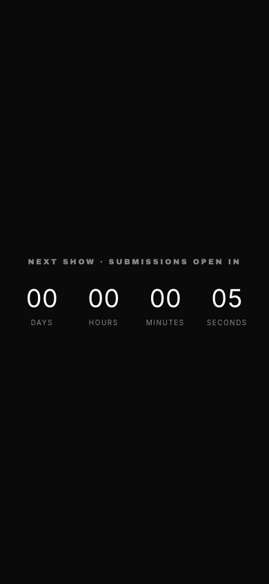
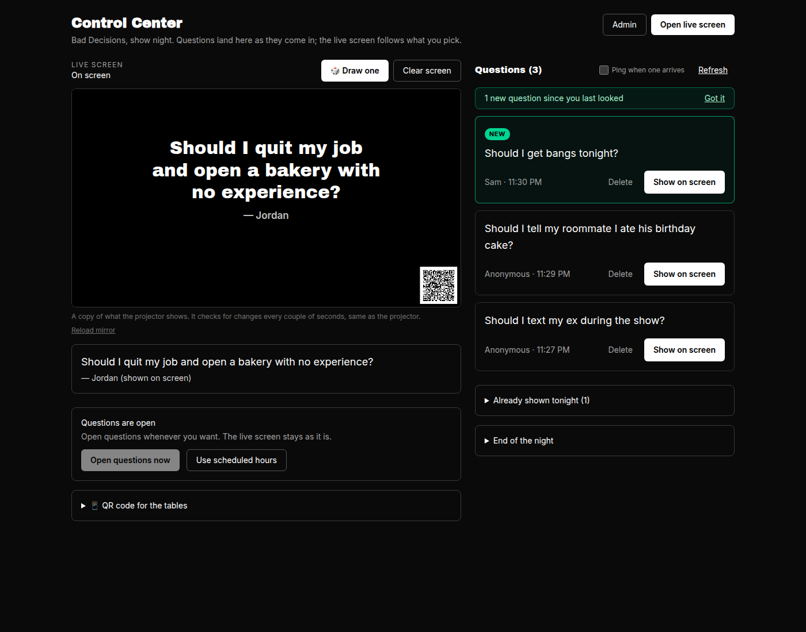
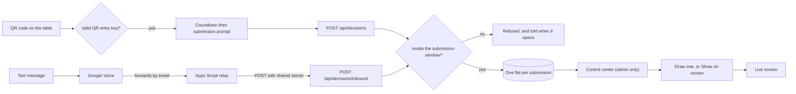

# Taylor Drew

### iOS & Full-Stack Developer · New York City

I build production software for creative work that happens in real time —
native iOS apps, full-stack web products, and tools that run live comedy shows
and film shoots while they are happening.

[Email](mailto:taylordrew4u@gmail.com) ·
[The Bit Binder on the App Store](https://apps.apple.com/us/app/the-bitbinder/id6756085897) ·
[Role-Call](https://rolecall.space) ·
[Bill Spilt](https://billspilt.com) ·
[Showrunner](https://icanrunashow.com)

---

## The code in this repository

This repo is both my profile and a working product:
**[pinsandneedlescomedy.com](https://pinsandneedlescomedy.com)**, the site for a
live stand-up show in Ridgewood, Queens, and the admin its producers use to run
it. Next.js 16, React 19, TypeScript, Tailwind 4 — **and no database.**

  

It is worth a look because the constraints are real rather than illustrative:
the people editing it are comedians on a phone, the audience hits it forty at a
time during one bar hour, and it has to cost nothing to run.

### The show page, and the control center that runs the show

<table>
<tr>
<td width="50%" valign="top">

 <em>The QR entry shows only a countdown, then switches to the submission prompt during the configured opening window.</em>
</td>
<td width="50%" valign="top">

 <em>The control center, only reachable signed in. Questions land on the right as they arrive; the mirror on the left is the real live page scaled down, so it shows exactly what the room sees.</em>
</td>
</tr>
</table>

### How a decision gets from the room to the stage

Every way in enforces the same window and the same sanitising, because the
server checks the submission window independently of the form. The web page
and its GET/POST submission API also require the signed QR entry key. Texting in needs no mailbox password anywhere: the site holds one
secret scoped to one endpoint, and a
[small relay script](docs/relay/gmail-apps-script.gs) posts to it.

### Control Center

- **Audience:** scan the existing signed QR to open the submission countdown/form.
- **Host:** `/admin/run-show` is the control center. It is a separate page that
  uses the admin password and is only linked from the admin. It shows the
  questions as they arrive, a mirror of the live screen, and every control for
  the night: Show on screen, Draw one, Clear screen, Open questions now, the QR
  code for the tables, Put it back, Delete, and Archive everything.
- **Display:** `/bad-decisions/live` is a separate public URL for the projector.
  It shows the selected question and a small audience submission QR in the bottom
  corner. A question stays up until the host shows another or taps Clear screen;
  new submissions and reloads never change it. Once a question has been on
  screen it leaves the waiting list and moves to "Already shown tonight", where
  Put it back returns it to the pile. Clearing the question keeps the QR visible.
  The sender's name shows under the question only when they ticked "Put my name
  on it"; other submissions and admin controls never appear on this screen.

Open **Control center** from admin, then **Open live screen** on the display
computer. Press **Full screen** (bottom-left when the mouse moves), the F key, or
double-click the live screen for full screen. It keeps the display awake, hides an
idle mouse pointer, and holds the current question through a dropped connection.
Choose **Show on screen** for any question, or **Draw one** to put a random
waiting question up. The live display checks for changes about every two
seconds; the control center checks for new questions every four seconds, marks
each new one, counts them in the tab title, and can play a short ping when one
arrives (a switch on the page, remembered per device). The mirror on the page is
the real live page loaded at projector size and scaled down, so it shows exactly
what the room sees. Use **Clear screen** when finished. Deleting the selected
submission or archiving the pile also clears the display. No selection produces
a blank screen with the QR.

**Open questions any time.** In the control center, tap **Open questions now** to accept
questions immediately, regardless of the scheduled hours. They stay open until
you tap **Use scheduled hours**. This does not clear the selected question or
change any other screen's live setting. The live screen URL stays
`https://pinsandneedlescomedy.com/bad-decisions/live`. Rehearsal controls have been
removed; existing practice data is left untouched and separate from live data.

**Show simulator.** `npm run build && npm run simulate` plays a whole show
night on a stand-in copy of the site: the production build on a fake GitHub
content store, with a guest's phone, the host's phone, the control center on a
laptop and the projector. It covers opening questions manually without changing the live screen, scheduled hours, a rush of 40 guests on one wifi, a dropped connection on the
projector, and then the whole control center: a question popping up flagged as
new, Draw one, Put it back, deleting the question on screen, Show and Clear, the
ping switch surviving a reload, the mirror matching the projector throughout, and
Archive everything from the page. Nothing real is touched. `npm run simulate -- --live` only reads the real site: pages, the
projector's QR, where it leads, and whether the form is open. Both write
`simulator-report/index.html` with screenshots. From a phone, run it in GitHub
under Actions → Show simulator → Run workflow; the report is attached to the
run. The simulator needs `npm i --no-save playwright jsqr && npx playwright
install chromium`.

Selection persists in `live-show/selection.json` on the configured content storage
driver (local filesystem, private GitHub content repo, or private Blob storage).
The public endpoint `/api/decisions/live` returns only the chosen question text.
The corner QR uses the same signed audience entry as the admin's downloadable QR;
its public image endpoint intentionally makes that audience entry available from
the live display, without publishing the question list.

### Printing the submission QR

Download the QR from the control center (**Admin → Control center → QR code
for the tables**) after deploying this version.
Older QR codes that contain only `/bad-decisions` now return 404. The new code
contains a stable entry key derived from `ADMIN_SECRET`; keep that secret stable
or reprint the QR after rotating it. Missing configuration fails closed.

The submission entry has no public menu or button, is excluded from the sitemap
and AI page list, and is marked noindex. A visitor with the QR link sees only the
countdown until the configured opening time, then the prompt and submission
controls. A shared copy of the QR link also grants access: browsers cannot prove
that a URL was opened by a camera scan.

### What is actually interesting here

- **Content is one JSON document merged over compiled-in defaults**, so a new
  field ships without a migration and a fresh deploy is already a finished site.
  Three interchangeable storage drivers — local filesystem, a private GitHub
  repo via the Contents API, or Vercel Blob — selected by which secrets exist.
- **Audience submissions are one file each.** Forty people scanning the same QR
  code in the same minute would lose writes against a shared array, so there is
  nothing to contend over.
- **Reads are driven by what a listing already tells you.** The control
  center polls every four seconds for the length of a show. Re-reading every
  file on each poll was measured at **14,640 GitHub API requests an hour
  against a 5,000 limit**, back when the panel polled every fifteen seconds,
  so it would have started failing mid-show. Each listing entry carries a
  content hash, so only files that actually changed are read, and a poll that
  finds nothing changed gets a 304 that GitHub does not count. The simulator
  checks this every run: idle polling costs zero counted requests.
- **Show times are New York wall-clock**, resolved against the zone's real
  offset for the date, so the DST changeover needs no maintenance.
- **The admin fails closed.** Credential policy lives in a module with no
  framework imports — so it is tested directly — and without both secrets set in
  production, every login is refused and every cookie stops verifying.
- **279 tests on the Node test runner.** No test framework and no transpile
  step, because the logic worth testing lives in plain modules. CI runs lint,
  typecheck, tests and a production build on every pull request.

**→ [Read the architecture notes](docs/ARCHITECTURE.md)** for the decisions and
what each one cost. [Deployment guide](docs/DEPLOYMENT.md).

---

## Other work

### [The Bit Binder](https://github.com/taylordrew4u2/The-Bit-Binder) · [App Store](https://apps.apple.com/us/app/the-bitbinder/id6756085897)

Native iOS app for stand-up comedians to capture, organize, record, transcribe
and refine material. SwiftUI, SwiftData, CloudKit, on-device transcription.

### [Showrunner](https://github.com/taylordrew4u2/Showrunner-ICanRunAShow)

Production tool used during live shows: builds lineups, imports schedules from
photos with AI, and runs a full-screen show mode with cue timers and walk-on
music. React and TypeScript.

### [Role-Call](https://github.com/taylordrew4u2/Role-Call)

End-to-end film-production planner for crew roles, cast, scripts, shot lists and
schedules. Next.js, TypeScript, Clerk, Drizzle.

### [The Trip Handler](https://github.com/taylordrew4u2/the-trip-handler)

Group-trip organizer with private invites, applications and approvals, shared
itineraries, expense tracking and Stripe payments.

### [Bill Spilt](https://github.com/taylordrew4u2/Bill-Spilt)

Full-stack tool for splitting household bills and keeping shared expenses
organized.

---

## Stack

- **iOS** — Swift, SwiftUI, SwiftData, CloudKit, on-device transcription and AI
- **Web** — Next.js, React, TypeScript, Tailwind CSS, PWAs
- **Backend** — Node.js, REST APIs, PostgreSQL, Turso, Prisma, Drizzle
- **Engineering** — authentication and session security, client-side encryption,
  offline sync, payments, testing, CI/CD, technical writing

## How I work

I try to write software that is still legible a year after launch, and to be
specific in the code about *why* something is the way it is — the storage
layout, the failure direction of an auth check, the option that was rejected and
what it would have cost. Most of the work I enjoy is turning a messy operational
process into a tool someone can trust while they are in the middle of using it.

---

Open to iOS and full-stack engineering roles, contract work, and interesting
product problems — New York City or remote.

**[taylordrew4u@gmail.com](mailto:taylordrew4u@gmail.com)**
